# 🐧 MLOps Penguins — Taller MLflow + PostgreSQL + MinIO

Implementación completa de un pipeline de MLOps para clasificación de
especies de pingüinos (Palmer Penguins Dataset), siguiendo la arquitectura
basada en servicios independientes comunicados por red.

---

## Arquitectura

```
                           Internet / Docker Network
  ┌──────────────┐    ┌──────────────────┐    ┌──────────────┐    ┌──────────────┐
  │  JupyterLab  │◄──►│     MLflow       │◄──►│    MinIO     │    │   FastAPI    │
  │  :8888       │    │  :5001           │    │  :9000/:9001 │    │   :8000      │
  └──────────────┘    └──────────────────┘    └──────────────┘    └──────────────┘
         │                    │                       │                   │
         └────────────────────┴───────────────────────┴───────────────────┘
                                        │
                              ┌─────────▼────────┐
                              │    PostgreSQL     │
                              │    :5432          │
                              │  ┌─────────────┐ │
                              │  │penguins_raw │ │
                              │  │penguins_proc│ │
                              │  │predict_log  │ │
                              │  └─────────────┘ │
                              └──────────────────┘

  MLflow internamente:
  ┌──────────────────────────────────────────┐
  │         systemd_service equivalent       │
  │  ┌──────────────┐    ┌────────────────┐  │
  │  │Model Registry│◄──►│Server Tracking │  │
  │  └──────────────┘    └────────────────┘  │
  │         │                    │            │
  │    PostgreSQL             MinIO S3        │
  │    (metadata)           (artifacts)       │
  └──────────────────────────────────────────┘
```

---

## Servicios

| Servicio    | Puerto | Descripción |
|-------------|--------|-------------|
| PostgreSQL  | 5432   | BD para metadata MLflow + datos raw + datos procesados |
| MinIO       | 9000   | API S3 — almacenamiento de artefactos |
| MinIO UI    | 9001   | Consola web de administración |
| MLflow      | 5001   | Tracking server + Model Registry |
| JupyterLab  | 8888   | Entorno de experimentación |
| FastAPI     | 8000   | API de inferencia |

---

## Estructura del proyecto

```
mlops-penguins/
├── docker-compose.yml          # Orquestación de todos los servicios
├── db-init/
│   └── 01_init.sql             # Esquema PostgreSQL (tablas raw, processed, log)
├── jupyter/
│   ├── Dockerfile              # Imagen JupyterLab
│   ├── requirements.txt
│   ├── data/
│   │   └── penguins.csv        # Dataset Palmer Penguins
│   └── notebooks/
│       └── penguins_mlflow.ipynb   # Notebook principal (20+ runs)
└── api/
    ├── Dockerfile              # Imagen FastAPI
    ├── requirements.txt
    └── main.py                 # Servicio de inferencia
```

---

## Requisitos

- Docker ≥ 24
- Docker Compose ≥ 2.20
- 4 GB RAM disponibles (recomendado 8 GB)

---

## Inicio rápido

### 1. Levantar todos los servicios

```bash
docker compose up -d
```


#### ⚠️ Flujo obligatorio antes de usar la API

> ⚠️ **IMPORTANTE:** La API de inferencia depende de un modelo previamente registrado en MLflow.
> Si no se ejecuta este paso, la API responderá con error (`model_loaded: false` o `503`).

##### Paso crítico: ejecutar Jupyter

Antes de usar la API o Locust:

1. Ir a:

```
http://localhost:8888
```

2. Abrir el notebook:

```
notebooks/penguins_mlflow.ipynb
```


3. Ejecutar TODAS las celdas en orden.

##### ¿Qué hace este paso?

Este proceso:

- carga datos en PostgreSQL
- entrena múltiples modelos
- registra experimentos en MLflow
- selecciona el mejor modelo
- lo registra en **MLflow Model Registry**
- lo mueve a stage **Production**

👉 **Este paso es obligatorio para que la API funcione correctamente.**

---

## Verificación del modelo

Después de ejecutar el notebook:

1. Ir a:

```
http://localhost:5001
```

2. Verificar:
- Existe el modelo `penguins-classifier`
- Está en stage **Production**

3. Validar en la API:


```
http://localhost:8000/docs
```

### 2. Verificar el estado

```bash
docker compose ps
docker compose logs -f mlflow      # ver progreso de instalación
```

> ⚠️ MLflow tarda ~2–3 minutos en instalar dependencias la primera vez.

### 3. Abrir JupyterLab

```
http://localhost:8888
```

Abrir y ejecutar el notebook:
```
notebooks/penguins_mlflow.ipynb
```

#### Inicio
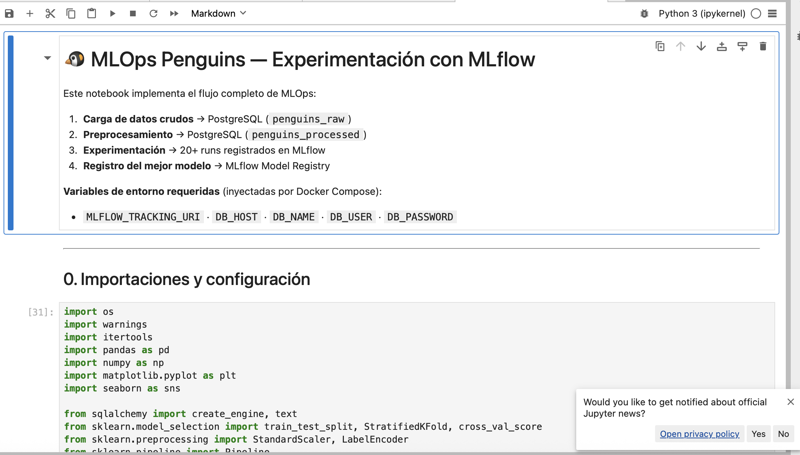

#### Distribucion de caracteristicas por especie
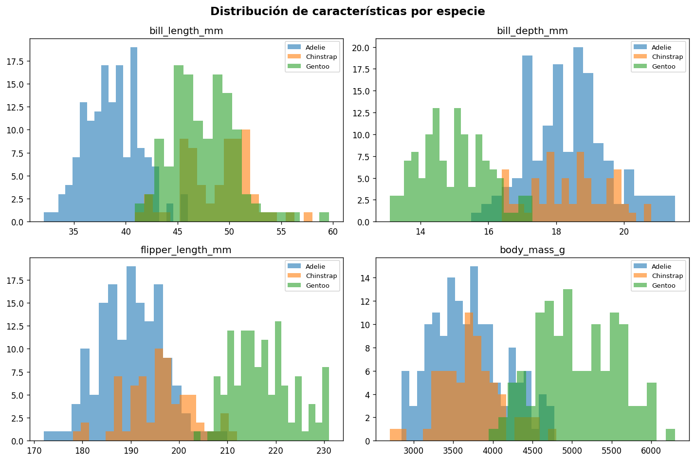

#### Guardar datos en PostgreSQL


#### Experimentacion Random Forest


#### Experimentacion Gradient Boosting


#### Experimentacion Logistic Regression


#### Experimentacion SVM


#### Experimentacion KNN
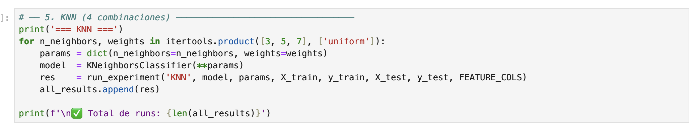

#### Resultados


#### Comparacion
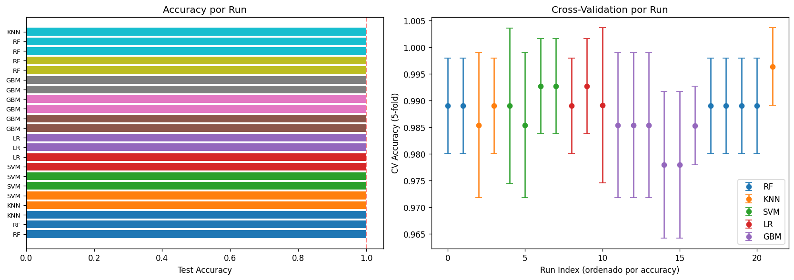

#### Resumen
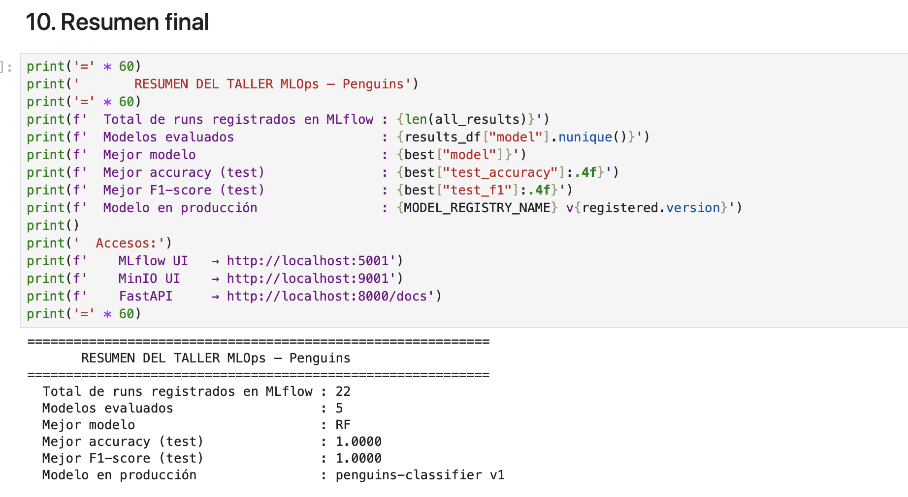


### 4. Ver experimentos en MLflow

```
http://localhost:5001
```

#### Runs


#### Metrics

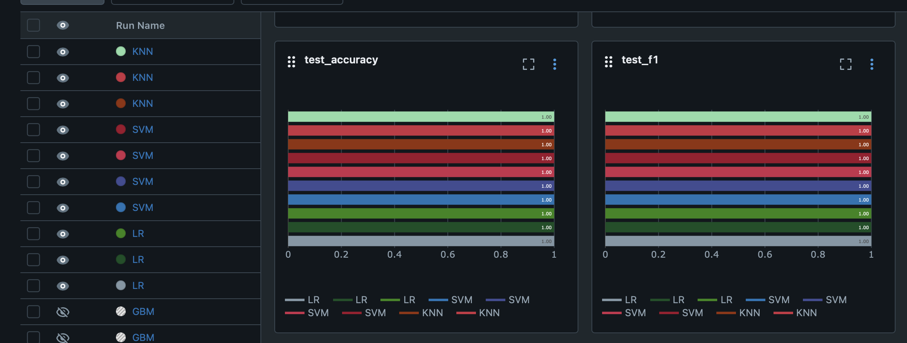
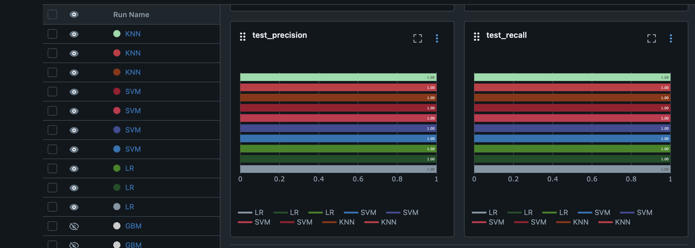

#### Model
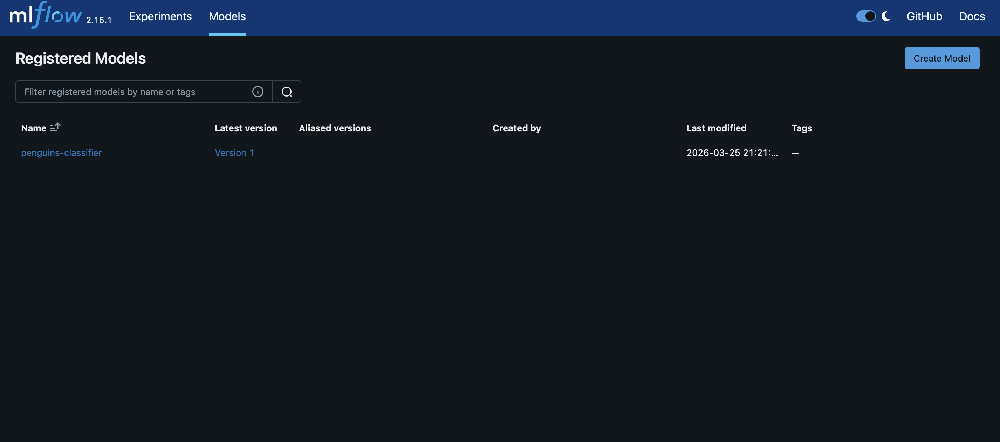

### 5. Ver artefactos en MinIO

```
http://localhost:9001
usuario   : minioadmin
contraseña: minioadmin123
```

### 6. Usar la API de inferencia

```
http://localhost:8000/docs
```

#### Artefactos
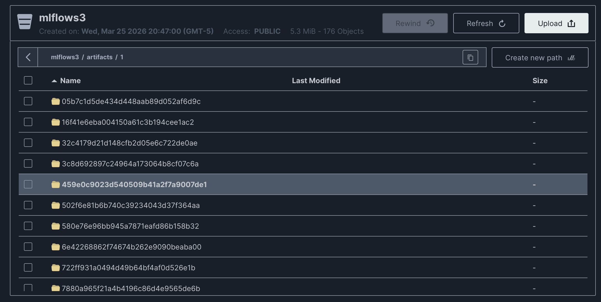


---

## Uso de la API

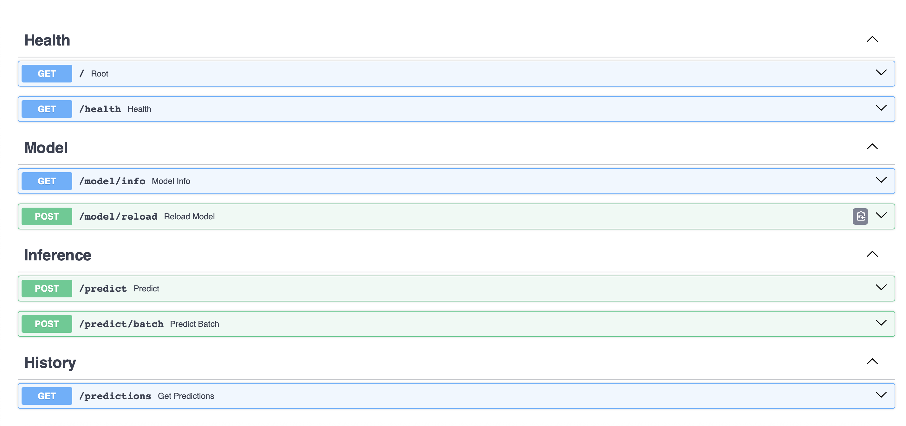
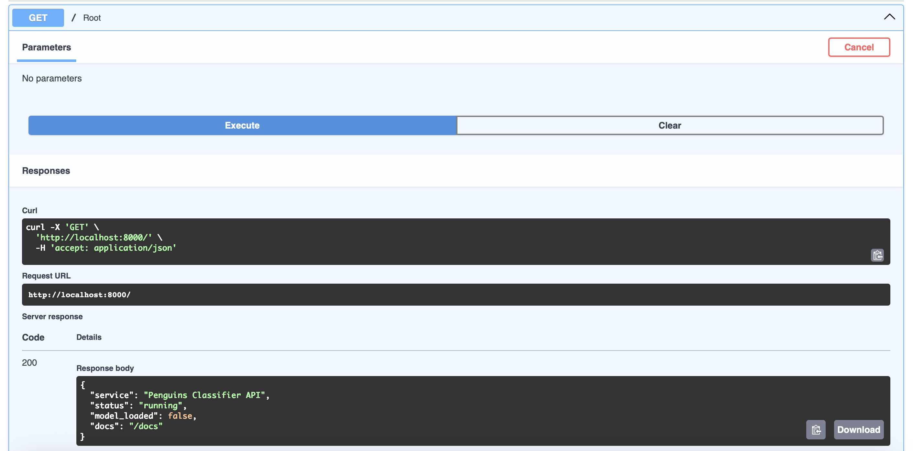
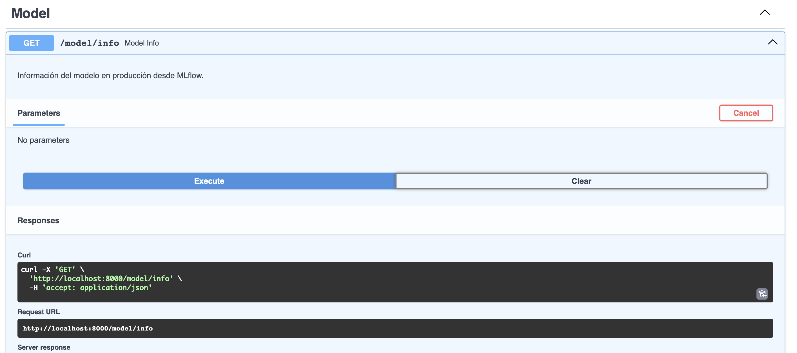
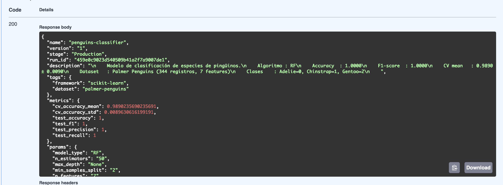


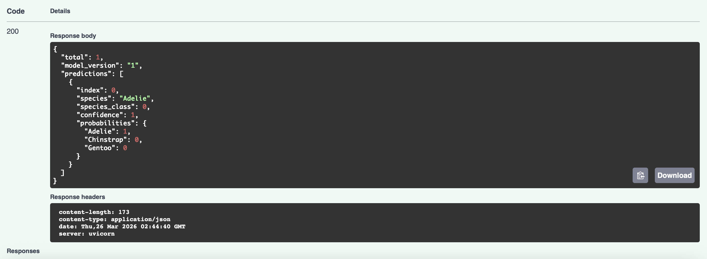
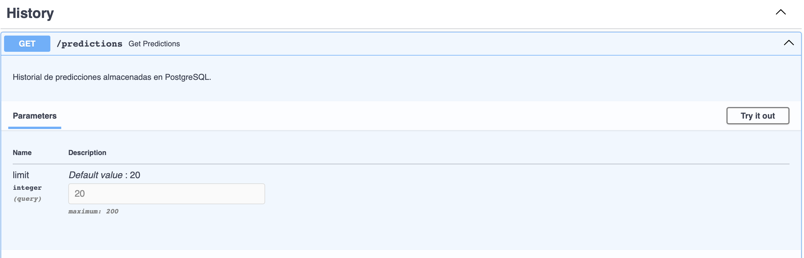


### Recargar modelo (sin reiniciar)

```bash
curl -X POST http://localhost:8000/model/reload
```

### Predicción individual

```bash
curl -X POST http://localhost:8000/predict \
  -H "Content-Type: application/json" \
  -d '{
    "bill_length_mm": 39.1,
    "bill_depth_mm": 18.7,
    "flipper_length_mm": 181.0,
    "body_mass_g": 3750.0,
    "island": "Torgersen",
    "sex": "male"
  }'
```

**Respuesta:**
```json
{
  "species": "Adelie",
  "species_class": 0,
  "confidence": 0.9823,
  "probabilities": {
    "Adelie": 0.9823,
    "Chinstrap": 0.0098,
    "Gentoo": 0.0079
  },
  "model_name": "penguins-classifier",
  "model_version": "1",
  "run_id": "abc123..."
}
```

### Predicción en lote

```bash
curl -X POST http://localhost:8000/predict/batch \
  -H "Content-Type: application/json" \
  -d '{
    "penguins": [
      {"bill_length_mm": 39.1, "bill_depth_mm": 18.7, "flipper_length_mm": 181.0, "body_mass_g": 3750.0, "island": "Torgersen", "sex": "male"},
      {"bill_length_mm": 46.5, "bill_depth_mm": 17.9, "flipper_length_mm": 192.0, "body_mass_g": 3500.0, "island": "Dream", "sex": "female"}
    ]
  }'
```

### Información del modelo

```bash
curl http://localhost:8000/model/info
```

### Historial de predicciones

```bash
curl "http://localhost:8000/predictions?limit=10"
```

---

## Base de datos PostgreSQL

Conexión directa (opcional):

```bash
docker exec -it mlops-postgres psql -U mlops -d mlops_db
```

Consultas útiles:

```sql
-- Datos crudos
SELECT species, COUNT(*) FROM penguins_raw GROUP BY species;

-- Datos procesados por split
SELECT split, COUNT(*) FROM penguins_processed GROUP BY split;

-- Historial de predicciones
SELECT predicted_species, COUNT(*), AVG(confidence)
FROM predictions_log
GROUP BY predicted_species;
```

---

## Pruebas de carga con Locust

Para evaluar la capacidad de la API bajo carga concurrente, se utilizó **Locust**.

---

### Estructura utilizada

Se creó un archivo adicional de orquestación:

```
docker-compose.locust.yml
```

Y una carpeta dedicada:


### Levantar Locust

```bash
docker compose -f docker-compose.locust.yml up
```

```
http://localhost:8089
```

```
  locust/
  └── locustfile.py
```

### Ejecución de Locust

Una vez que todos los servicios del sistema están corriendo (docker compose up -d), se levanta Locust con:

```bash
docker compose -f docker-compose.locust.yml up -d
```

### Interfaz de usuario

Acceder a la interfaz web de Locust en:

```bash
http://localhost:8089
```

### Configuración de pruebas

En la interfaz de Locust se deben configurar los siguientes parámetros:

1. Number of users: Número de usuarios concurrentes
2. Ramp up: Velocidad de creación de usuarios (usuarios/segundo)
3. Host: URL del servicio objetivo

#### Prueba de validación inicial

Antes de realizar pruebas de alta carga, se ejecutó una prueba controlada para verificar el correcto funcionamiento del sistema.

1. Number of users: 2
2. Ramp up: 2

Esta prueba permitió validar:

- correcta comunicación entre contenedores
- correcto funcionamiento del endpoint /predict
- ausencia de errores iniciales

#### Métricas recolectadas

Durante las pruebas se analizaron los siguientes indicadores:

- RPS (Requests per second): número de solicitudes procesadas por segundo
- Response Time: tiempo de respuesta promedio
- Percentiles (95%, 99%): comportamiento bajo carga extrema
- Failures (%): porcentaje de errores
- Throughput: capacidad total del sistema

#### Estrategia de experimentación

#### Estrategia de experimentación

Las pruebas de carga se plantearon de forma incremental con el objetivo de evaluar el comportamiento del sistema hasta 10.000 usuarios concurrentes, aumentando la carga progresivamente en diferentes etapas.

La estrategia experimental se dividió en tres fases:

- **Fase 1 — Línea base con una sola instancia y sin límites de recursos**
  - 10 usuarios
  - 100 usuarios
  - 500 usuarios
  - 1000 usuarios
  - 1500 usuarios
  - 2000 usuarios
  - ...

- **Fase 2 — Evaluación con límites de CPU y memoria**
  - reducción progresiva de recursos del contenedor de inferencia
  - medición del impacto sobre latencia, throughput y errores

- **Fase 3 — Evaluación con múltiples réplicas**
  - incremento del número de instancias de la API
  - comparación frente al escenario de una sola instancia
  - continuación de la carga progresiva hasta 10.000 usuarios o hasta encontrar el máximo soportado

En cada experimento se registraron:

- tiempo de respuesta
- tasa de errores
- estabilidad del sistema

#### Experimentos

##### Experimento 1: 10 usuarios

- Users: 10
- Ramp up: 2

Resultados:

- RPS: ~6.6
- Tiempo promedio: ~18.9 ms
- P95: ~37 ms
- Fallos: 0%

###### Análisis

El sistema mostró un comportamiento completamente estable bajo baja carga.

El tiempo de respuesta se mantuvo bajo (~19 ms en promedio), indicando que el modelo se encuentra correctamente cargado en memoria y que la inferencia es eficiente.

No se presentaron errores ni degradación del servicio, lo que confirma que la arquitectura es funcional en condiciones de carga ligera.


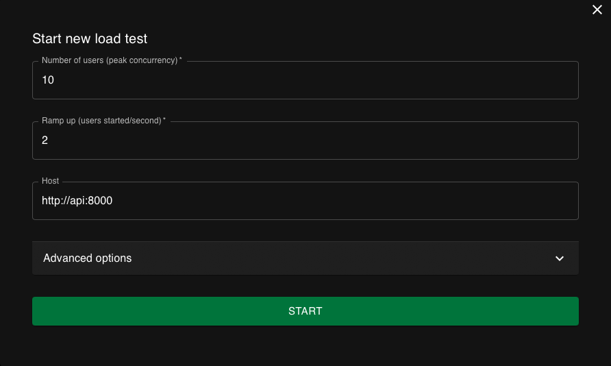

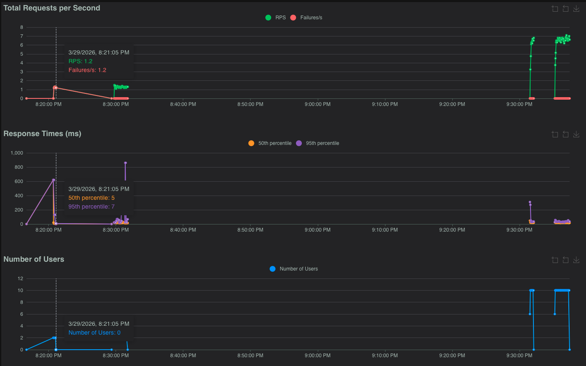

##### Experimento 2: 100 usuarios

- Users: 100
- Ramp up: 10

Resultados:

- RPS: ~44.6
- Tiempo promedio: ~475 ms
- P95: ~1200 ms
- P99: ~3000 ms
- Fallos: 0%

###### Análisis

El sistema continúa funcionando sin errores bajo una carga de 100 usuarios concurrentes, sin embargo, se observa una degradación significativa en los tiempos de respuesta.

El tiempo promedio aumentó considerablemente (~476 ms), y los percentiles altos (P95 y P99) evidencian que algunos usuarios experimentan latencias superiores a 1 segundo e incluso cercanas a 3 segundos.

Esto indica la aparición de un cuello de botella en el sistema, probablemente asociado a limitaciones de CPU o a la capacidad de procesamiento concurrente de la API.

Aunque el sistema no falla, ya no escala de manera eficiente, lo que sugiere que se está acercando a su límite operativo bajo esta configuración.

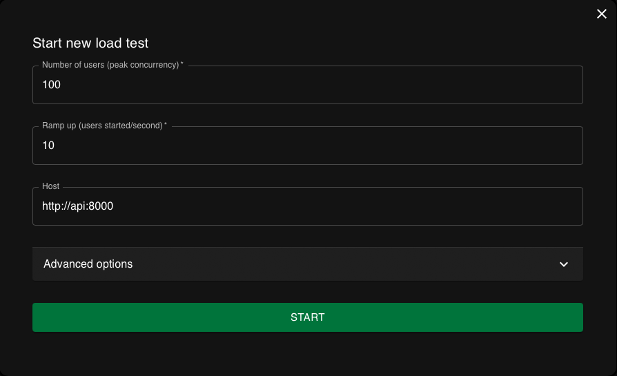
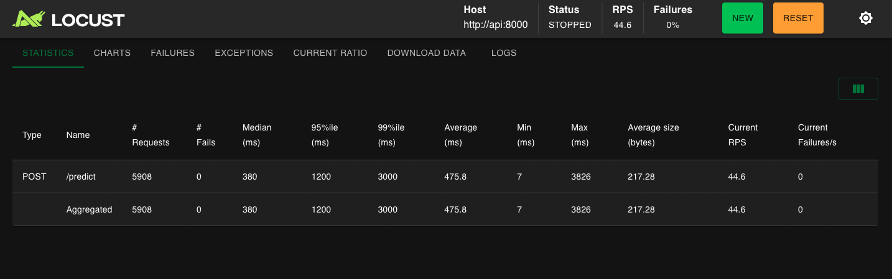
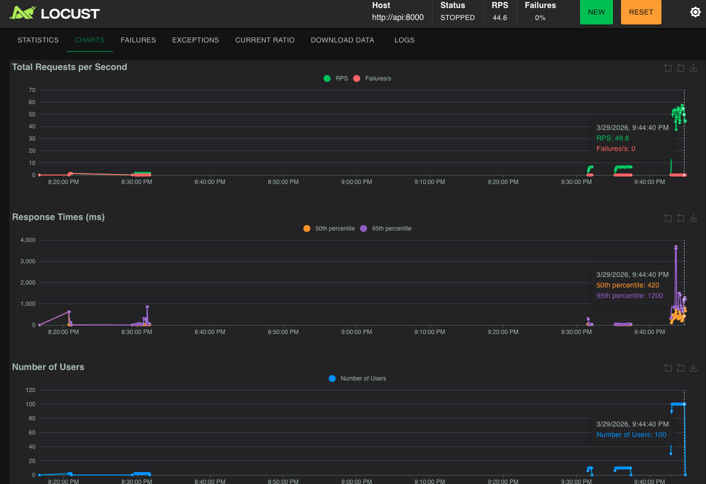

##### Experimento 3: 500 usuarios

- Users: 500
- Ramp up: 50

Resultados:

- RPS: ~61
- Tiempo promedio: ~6378 ms
- P95: ~7600 ms
- P99: ~27000 ms
- Fallos: 0%

###### Análisis

Aunque el sistema no presenta errores bajo una carga de 500 usuarios concurrentes, se observa una degradación crítica en los tiempos de respuesta.

El tiempo promedio supera los 6 segundos, mientras que el percentil 99 alcanza valores cercanos a los 27 segundos, lo que indica una saturación del sistema.

Adicionalmente, el throughput (RPS) deja de escalar proporcionalmente con el número de usuarios, evidenciando un cuello de botella en la capacidad de procesamiento.

Esto indica que el sistema ha alcanzado su límite operativo bajo esta configuración, siendo incapaz de manejar eficientemente una carga de 500 usuarios concurrentes.

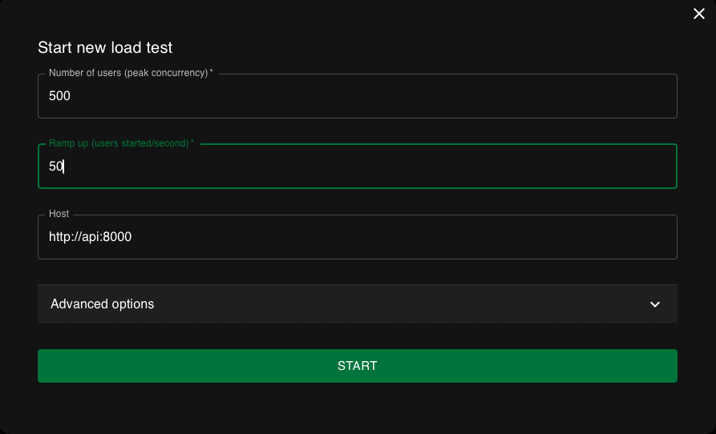
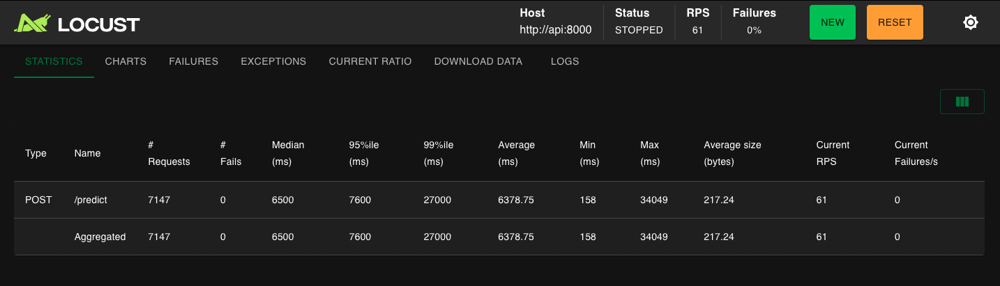
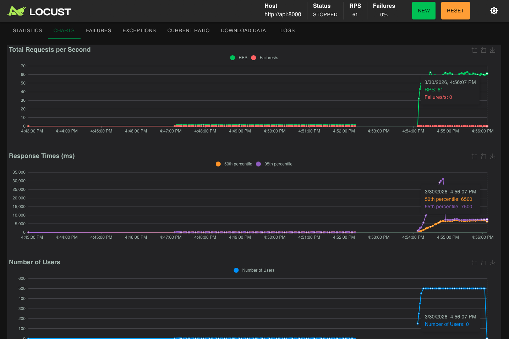

##### Experimento 4: 1000 usuarios

- Users: 1000
- Ramp up: 100

Resultados:

- RPS: ~59
- Tiempo promedio: ~15111 ms
- P95: ~59000 ms
- P99: ~86000 ms
- Fallos: 0%

###### Análisis

El sistema presenta una degradación crítica bajo una carga de 1000 usuarios concurrentes.

Aunque no se observan errores en las respuestas, los tiempos de latencia alcanzan valores extremadamente altos, con promedios superiores a 15 segundos y percentiles cercanos a 1 minuto.

El throughput (RPS) no muestra mejoras respecto a cargas menores, lo que indica que el sistema ha alcanzado su capacidad máxima de procesamiento.

Esto evidencia que la arquitectura actual no escala adecuadamente con el aumento de usuarios, generando colas de solicitudes y tiempos de espera inaceptables.

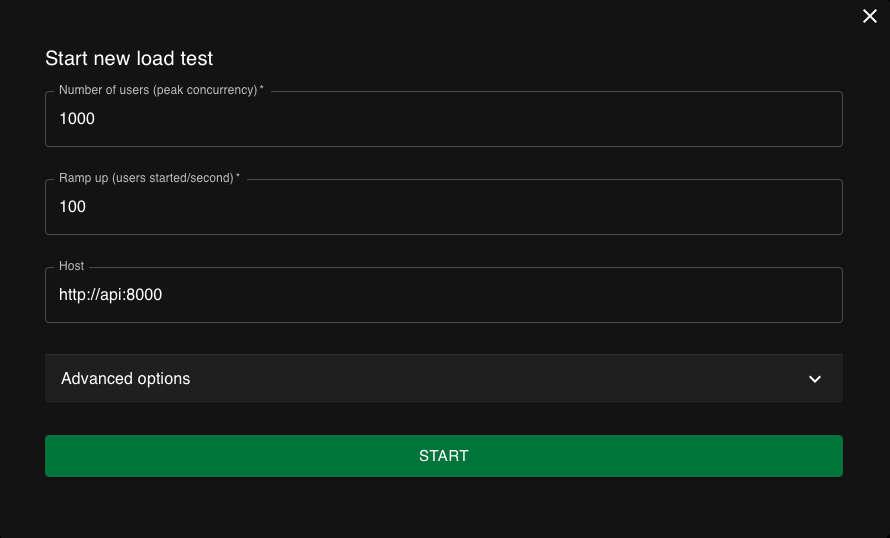
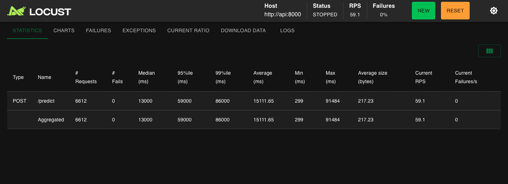
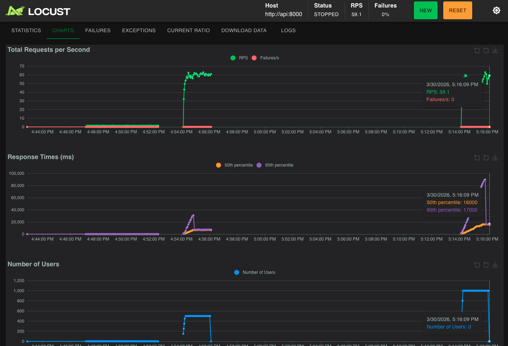

Debido a la saturación observada a partir de 500 usuarios y el colapso de latencia a 1000 usuarios, no es necesario escalar hasta 10.000 usuarios bajo esta configuración, ya que el sistema claramente no soporta dicha carga con una sola instancia.

##### Experimentos con recursos limitados

Se limitaron los recursos del contenedor de inferencia a:

- CPU: 0.50
- Memoria: 512 MB

Posteriormente se repitieron las pruebas de carga para comparar el impacto sobre:

- latencia
- throughput
- estabilidad
- número máximo de usuarios soportados

###### Experimento L1: 100 usuarios (recursos limitados)

- CPU: 0.50
- Memoria: 512 MB

Resultados:

- RPS: ~11.8
- Tiempo promedio: ~5525 ms
- P95: ~7800 ms
- P99: ~12000 ms
- Fallos: 0%

###### Análisis

Al limitar los recursos del contenedor de inferencia, se observa una degradación significativa en el rendimiento del sistema.

El tiempo de respuesta promedio aumenta considerablemente (más de 5 segundos), y el throughput se reduce drásticamente en comparación con el escenario sin limitaciones.

Esto indica que la capacidad de procesamiento del sistema está fuertemente ligada a los recursos disponibles, y que al restringir CPU y memoria, el sistema alcanza su punto de saturación con una carga mucho menor.


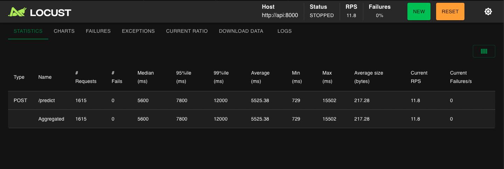
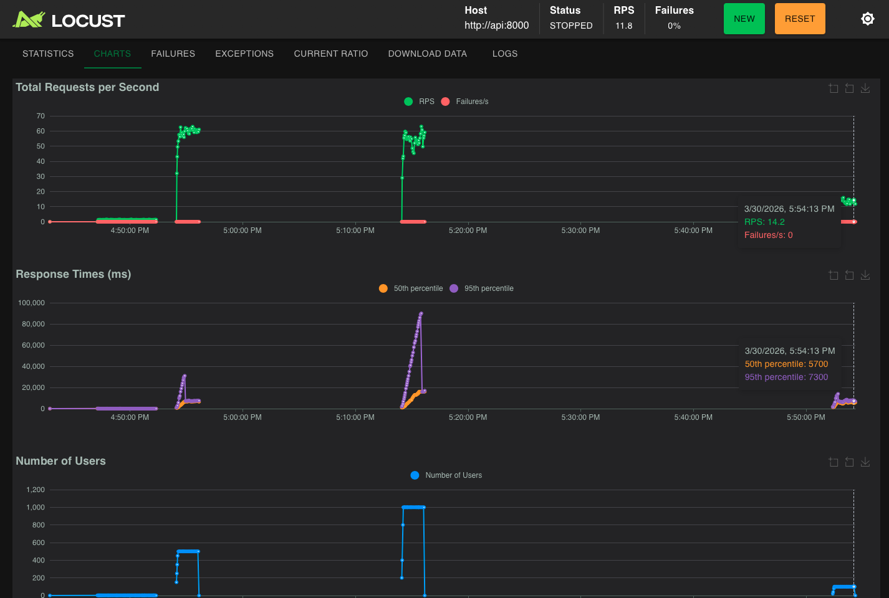


###### Experimento L2: 500 usuarios (recursos limitados)

- CPU: 0.50
- Memoria: 512 MB

Resultados:

- RPS: ~13.3
- Tiempo promedio: ~21139 ms
- P95: ~83000 ms
- P99: ~107000 ms
- Fallos: 0%

###### Análisis

Bajo una carga de 500 usuarios concurrentes y con recursos limitados, el sistema presenta un colapso completo en los tiempos de respuesta.

El tiempo promedio supera los 21 segundos, mientras que los percentiles altos alcanzan valores superiores a 1 minuto, lo que indica una saturación extrema.

El throughput se reduce significativamente respecto al escenario sin limitaciones, evidenciando que la restricción de CPU y memoria impacta de forma crítica la capacidad del sistema.

En este escenario, el sistema deja de ser viable incluso para cargas moderadas.

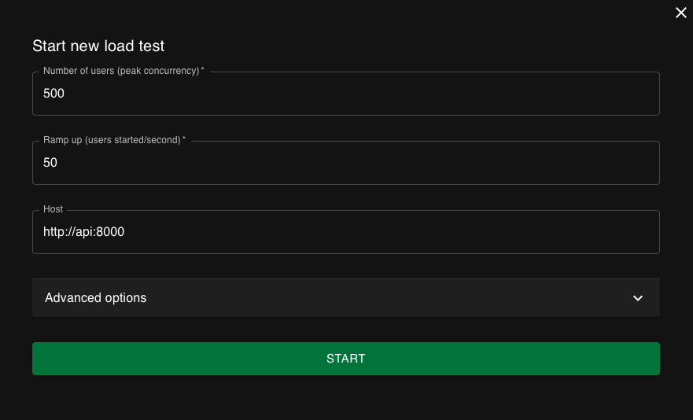
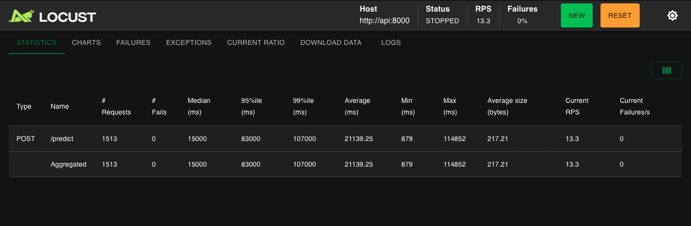
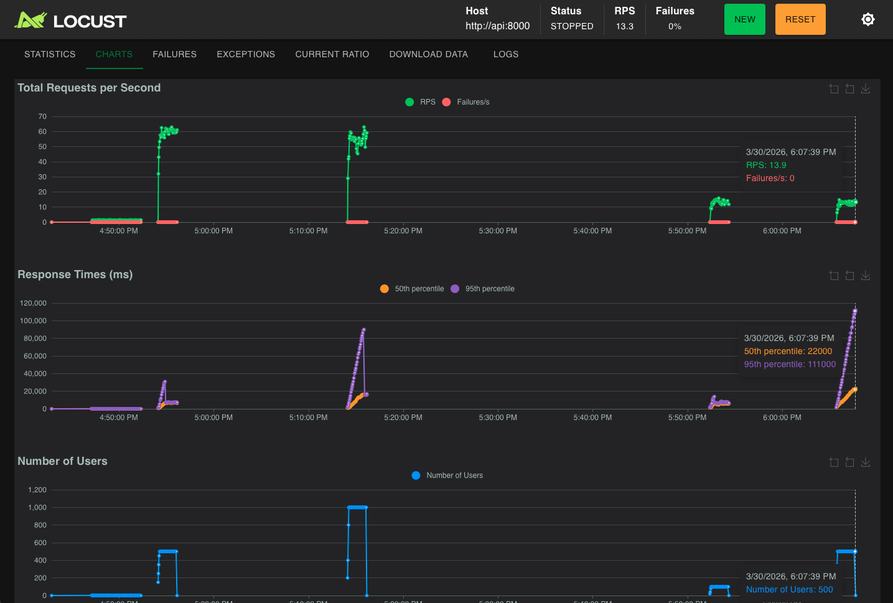

---

##### Experimentos con múltiples instancias (Escalamiento horizontal)

Con el objetivo de evaluar si el sistema es capaz de mejorar su capacidad de procesamiento mediante escalamiento horizontal, se realizaron pruebas utilizando múltiples instancias del servicio de inferencia.

En este escenario, se eliminaron las restricciones de puertos expuestos y se desplegaron varias réplicas del contenedor de la API utilizando Docker Compose.

---

##### Configuración

Se levantaron múltiples instancias del servicio de inferencia con el siguiente comando:

```bash
docker compose up -d --scale api=3
```

###### Experimento R1: 500 usuarios (3 réplicas)

Resultados:

- RPS: ~42.7
- Tiempo promedio: ~9752 ms
- P95: ~14000 ms
- Fallos: 0%

###### Análisis

El uso de múltiples réplicas del servicio de inferencia no generó una mejora en el rendimiento respecto al escenario de una sola instancia sin limitaciones.

Aunque se observa una mejora frente al escenario con recursos limitados, el sistema presenta un rendimiento inferior al baseline original.

Esto sugiere que el escalamiento horizontal en este entorno no está siendo efectivo, posiblemente debido a la ausencia de un balanceador de carga adecuado y a limitaciones en los recursos del host.

Además, el overhead introducido por múltiples contenedores puede afectar negativamente el desempeño general.

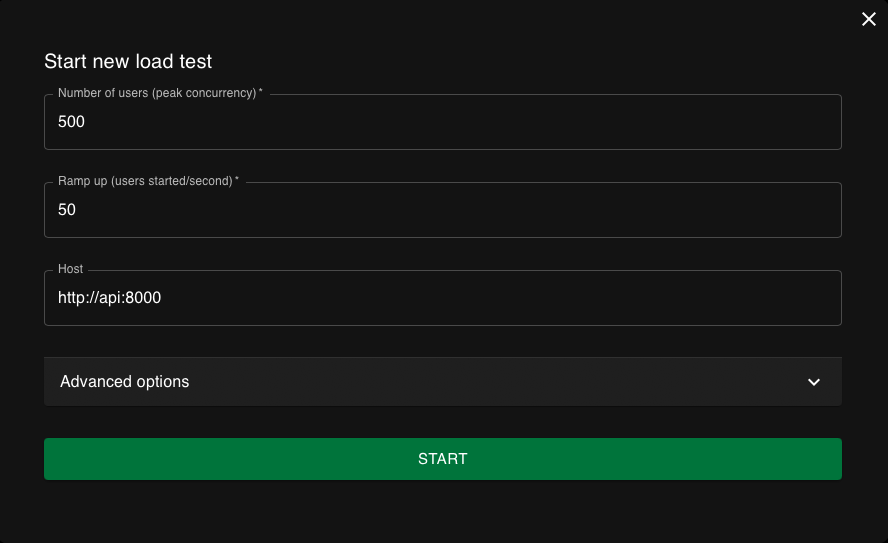
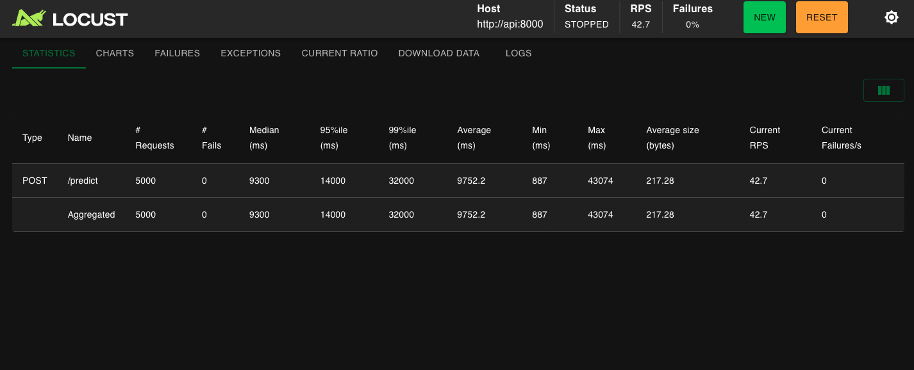
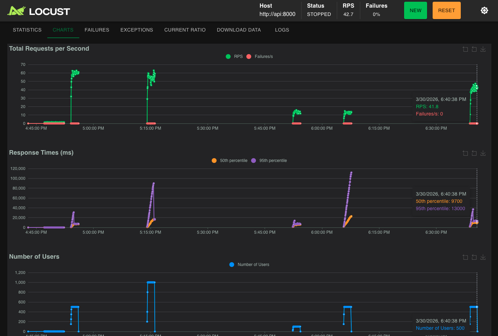

###### Experimento R2: 1000 usuarios (3 instancias)

Resultados:

- RPS: ~45.4
- Tiempo promedio: ~21186 ms
- P95: ~76000 ms
- P99: ~98000 ms
- Fallos: 0%

###### Análisis

Al incrementar la carga a 1000 usuarios concurrentes utilizando 3 instancias del servicio de inferencia, el sistema no presenta errores, pero evidencia una degradación severa en los tiempos de respuesta.

El throughput se mantiene alrededor de 45 requests por segundo, valor similar al observado en cargas menores con múltiples instancias, lo que indica que el sistema ha alcanzado su capacidad máxima de procesamiento en esta configuración.

Aunque el uso de múltiples instancias permite una mejora frente al escenario con recursos limitados, no representa una mejora frente al baseline sin limitaciones. En este experimento, el aumento de usuarios no se traduce en mayor capacidad efectiva, sino en un crecimiento excesivo de la latencia.

Esto sugiere que el escalamiento horizontal en este entorno no es suficiente para soportar altas cargas concurrentes, posiblemente debido a:

- ausencia de un balanceador de carga avanzado
- limitaciones de recursos del host
- overhead asociado al uso de múltiples contenedores
- cuellos de botella propios de la aplicación y del entorno de ejecución

En consecuencia, se concluye que el sistema no logra escalar de manera eficiente hacia cargas cercanas a 10.000 usuarios concurrentes en esta arquitectura.

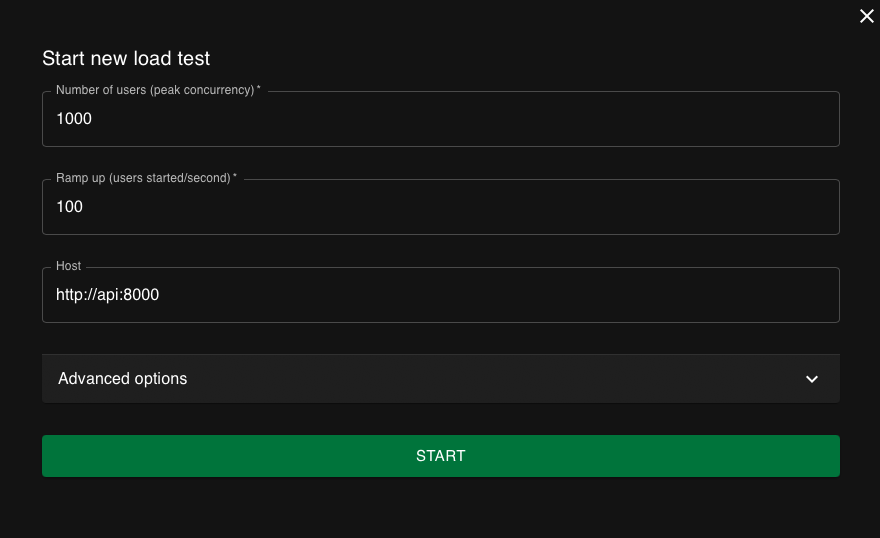
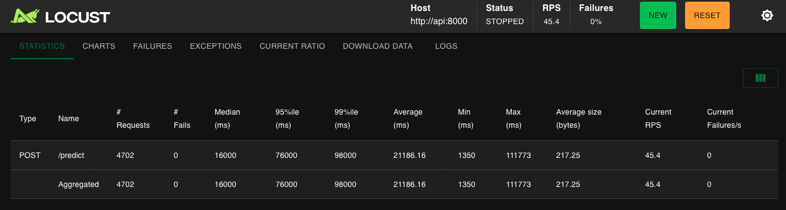
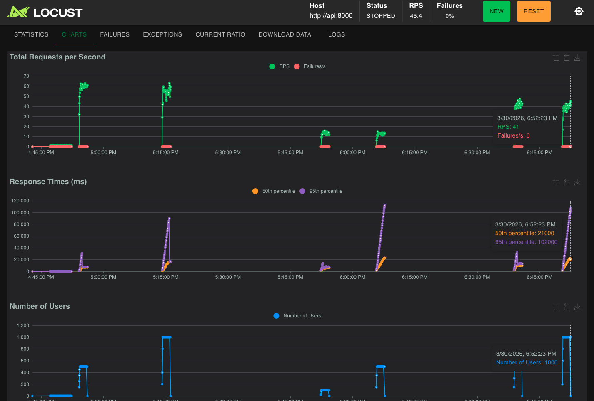

# Conclusiones

### 1. Imagen Docker con API FastAPI para inferencia

Se construyó una imagen Docker que contiene una API desarrollada en **FastAPI**, encargada de realizar inferencia sobre un modelo de clasificación de especies de pingüinos.

La API expone endpoints como:

- `/predict`
- `/predict/batch`
- `/model/info`
- `/model/reload`

---

### 2. Consumo del modelo desde MLflow

La API no utiliza un modelo embebido localmente, sino que carga dinámicamente el modelo desde **MLflow Model Registry**, específicamente desde el stage **Production**.

Esto permitió desacoplar el servicio de inferencia del proceso de entrenamiento, siguiendo una arquitectura más cercana a un entorno MLOps real.

---

### 3. Publicación de la imagen en DockerHub

La imagen de inferencia fue publicada en DockerHub y utilizada posteriormente en los experimentos.

Imagen publicada:

```text
orozcojacobo/penguins-inference:latest
```

### 4. docker-compose para usar la imagen publicada

Se creó un archivo de orquestación que permite levantar el sistema utilizando la imagen publicada de la API, integrándola con los servicios necesarios de soporte:

PostgreSQL
MinIO
MLflow
JupyterLab
FastAPI

En la práctica, el archivo principal docker-compose.yml fue el utilizado para levantar la arquitectura completa y probar la imagen publicada en un entorno funcional.

### 5. docker-compose diferente para pruebas de carga con Locust

Se creó un archivo adicional:

``` bash
docker-compose.locust.yml
```

Este archivo permitió levantar un contenedor independiente con Locust, conectado a la red interna de Docker para ejecutar pruebas de carga contra la API de inferencia.

El acceso a la herramienta se realizó mediante:

```
http://localhost:8089
```
### 6. Limitación de recursos del contenedor de inferencia

Se realizaron experimentos limitando los recursos del contenedor de inferencia a:

CPU: 0.50
Memoria: 512 MB

Con esta configuración, el sistema presentó una degradación crítica incluso con cargas moderadas, alcanzando tiempos de respuesta muy altos desde 100 usuarios concurrentes y colapsando funcionalmente en 500 usuarios.

Por lo tanto, estos recursos no son suficientes para soportar 10.000 usuarios.

### 7. Incremento de réplicas de la API y comportamiento observado

Posteriormente se levantaron 3 instancias del servicio API utilizando:

```
docker compose up -d --scale api=3
```

El objetivo fue evaluar si el escalamiento horizontal mejoraba la capacidad del sistema.

Comportamiento observado
El uso de múltiples instancias mejoró el rendimiento frente al escenario con recursos limitados.
Sin embargo, no mejoró el rendimiento frente al baseline original con una sola instancia sin limitaciones.
El throughput se mantuvo aproximadamente entre 42 y 45 RPS, mientras que la latencia aumentó de forma considerable al incrementar la carga.

Esto sugiere que el escalamiento horizontal en este entorno no fue suficiente para resolver los cuellos de botella presentes.

### 8. ¿Es posible reducir más los recursos?

No es recomendable.

Con 0.50 CPU y 512 MB de memoria, el sistema ya mostró una degradación severa del rendimiento.

Reducir aún más los recursos probablemente haría que el sistema colapsara con una cantidad todavía menor de usuarios concurrentes.

### 9. ¿Cuál es la mayor cantidad de peticiones soportadas?

La mayor capacidad observada del sistema fue de aproximadamente:

~45 requests por segundo (RPS)

A partir de este punto, el sistema no incrementó significativamente su throughput, y el aumento de usuarios solo produjo un crecimiento excesivo en la latencia.

### 10. ¿Qué diferencia hay entre una o múltiples instancias?
Una sola instancia
Mejor rendimiento base
Menor latencia en cargas bajas y medias
Saturación visible a partir de 500 usuarios
Múltiples instancias
Mejor comportamiento frente al escenario con recursos limitados
No mejoraron el baseline original
Introdujeron overhead adicional
No lograron escalar linealmente el sistema

En consecuencia, más instancias no implicaron automáticamente mejor rendimiento en este entorno.

### 11. Si no se logra llegar a 10.000 usuarios, ¿cuál es la cantidad máxima alcanzada?

No fue posible llegar a 10.000 usuarios concurrentes de manera funcional.

Los experimentos mostraron que:

con una sola instancia, el sistema ya se encontraba saturado a partir de 500 usuarios
con 1000 usuarios, la latencia era ya excesiva e inviable
con múltiples instancias, el sistema tampoco logró escalar de forma suficiente para acercarse a 10.000 usuarios

Por lo tanto, la cantidad máxima alcanzada de manera experimental fue de 1000 usuarios concurrentes, aunque con tiempos de respuesta inaceptables.

Desde el punto de vista funcional, el límite operativo razonable del sistema se encuentra muy por debajo de ese valor.

## Flujo del notebook (20+ experimentos)

1. **Carga raw** → CSV `penguins.csv` → tabla `penguins_raw` en PostgreSQL
2. **Preprocesamiento** → limpieza, one-hot encoding, label encoding → tabla `penguins_processed`
3. **Experimentación** con 5 algoritmos y variaciones de hiperparámetros:

| Algoritmo | Parámetros variados | Runs |
|-----------|--------------------|----|
| Random Forest | n_estimators, max_depth | 6 |
| Gradient Boosting | learning_rate, n_estimators | 6 |
| Logistic Regression | C, solver | 3 |
| SVM | C, kernel | 4 |
| KNN | n_neighbors, weights | 3 |
| **Total** | | **22 runs** |

4. **Selección** del mejor modelo por `test_accuracy`
5. **Registro** en MLflow Model Registry → stage `Production`
6. **Validación** cargando el modelo desde el Registry

---

## Parar el ambiente

```bash
# Parar sin borrar datos
docker compose down

# Parar y borrar volúmenes (reset total)
docker compose down -v

# Para apagar locust
docker compose -f docker-compose.locust.yml down

```

---

## Variables de entorno

| Variable | Valor por defecto | Descripción |
|----------|------------------|-------------|
| `POSTGRES_USER` | mlops | Usuario PostgreSQL |
| `POSTGRES_PASSWORD` | mlops_secret | Contraseña PostgreSQL |
| `POSTGRES_DB` | mlops_db | Base de datos |
| `MINIO_ROOT_USER` | minioadmin | Usuario MinIO |
| `MINIO_ROOT_PASSWORD` | minioadmin123 | Contraseña MinIO |
| `MLFLOW_S3_ENDPOINT_URL` | http://minio:9000 | Endpoint MinIO como S3 |

---

## Clases predichas

| Código | Especie | Descripción |
|--------|---------|-------------|
| 0 | Adelie | La más común (152 muestras) |
| 1 | Chinstrap | Menos frecuente (68 muestras) |
| 2 | Gentoo | Tamaño mayor (124 muestras) |